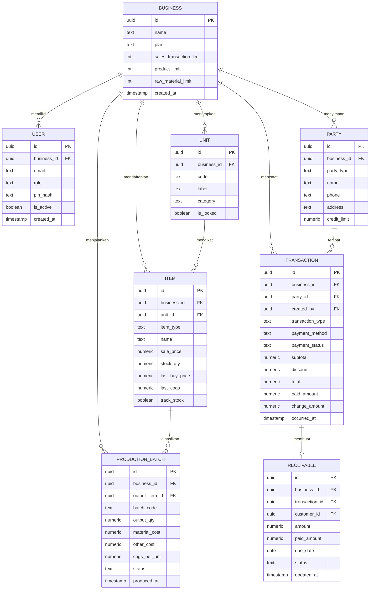

# PRD: DapurKasir

## Ringkasan Produk

DapurKasir adalah SaaS web app POS + inventori + produksi untuk UMKM kuliner yang membuat produk sendiri, seperti sambal, chili oil, surabi, dan cireng isi. Produk ini menggabungkan kasir cepat, pengelolaan stok bahan baku/produk jadi, produksi batch, perhitungan COGS otomatis, piutang, pengeluaran, dan laporan laba rugi sederhana.

Target utama adalah owner UMKM yang masih memakai buku catatan/kertas dan kasir yang perlu alur transaksi sangat sederhana. Nilai jual utama DapurKasir adalah kejelasan keuangan: owner tidak hanya melihat omzet, tetapi juga COGS, laba kotor, pengeluaran, dan net profit secara otomatis.

Model bisnis: paket Gratis dengan batas 50 transaksi POS/bulan, 30 produk, dan 10 bahan baku; paket PRO tanpa batasan tersebut. Aplikasi dirancang mobile/tablet-first, mendukung printer thermal Bluetooth 58/80 mm, dan memaksa input terstandar melalui search + dropdown tanpa free-text liar.

## Pernyataan Masalah

UMKM kuliner produksi sering mencatat penjualan, stok, belanja bahan, dan piutang secara terpisah di buku/kertas. Akibatnya owner tidak tahu laba bersih sebenarnya, kasir lambat karena input bebas, dan stok mudah selisih.

Masalah inti:
- Satuan tidak konsisten: “500 mili”, “½ kg”, “1 botol kecil”, sehingga stok dan harga sulit dihitung.
- Kasir harus mengingat/mengetik manual, menyebabkan antrean dan kesalahan input.
- Owner tidak mengetahui COGS per produk karena produksi bahan baku tidak terhubung ke penjualan.
- Piutang pelanggan dan utang supplier tidak terpantau, sering lupa ditagih/dibayar.
- Pengeluaran operasional tidak tercatat, sehingga omzet terlihat besar tetapi laba bersih tidak jelas.
- Solusi POS existing umumnya fokus penjualan, tetapi lemah di produksi batch dan perhitungan laba.

Dampak bisnis: keputusan harga salah, stok bahan habis mendadak, uang tertahan di piutang, dan owner merasa “usaha jalan tapi hanya capek”.

## Tujuan & Objektif

| Tujuan | Metrik | Target Awal |
|---|---:|---:|
| Kasir menyelesaikan transaksi cepat dan minim error | Median durasi transaksi POS | ≤ 45 detik |
| Owner memahami untung/rugi | Dashboard laba dibuka ≥ 3x/minggu per bisnis aktif | ≥ 60% bisnis aktif |
| Data stok dan satuan rapi | Produk/bahan memakai unit standar | 100% |
| COGS terbentuk otomatis | Produk hasil produksi memiliki `last_cogs` terisi | ≥ 95% produk aktif |
| Piutang tidak hilang | Piutang tercatat dan status pembayaran jelas | 100% penjualan kredit |
| Adopsi awal | Bisnis baru menyelesaikan setup master data + 1 produksi + 1 transaksi POS dalam 7 hari | ≥ 70% |
| Monetisasi | Konversi Free → PRO pada bisnis > 50 transaksi/bulan | ≥ 20% dalam 3 bulan |

Objek produk bukan sekadar “ada fitur POS”, tetapi menghasilkan outcome: transaksi cepat, data bersih, dan keputusan laba yang terlihat oleh owner.

## Target Pengguna

| Segmen | Karakteristik | Kebutuhan Utama |
|---|---|---|
| Owner UMKM kuliner produksi | Memiliki usaha sambal, chili oil, kue, surabi, cireng; 1–5 karyawan; masih pakai catatan manual | Lihat laba bersih, kontrol stok, produksi, piutang, pengeluaran, laporan |
| Kasir/pegawai outlet | Kerja di counter, butuh cepat, tidak ingin banyak form | Cari produk, tap qty, bayar, print struk, lihat stok |
| Owner merangkap kasir | Usaha kecil, sering jaga sendiri | Aplikasi ringan, mobile/tablet, tidak perlu setup rumit |

Konteks pemakaian:
- Perangkat utama: Android/tablet, kadang laptop owner.
- Koneksi internet tidak selalu stabil, tetapi MVP mengutamakan online; offline-light dipertimbangkan.
- Printer thermal Bluetooth 58/80 mm untuk struk.
- Volume tinggi: beberapa target dapat mencapai 100+ transaksi/hari dan 100+ produk.

## Fitur Inti

| Prioritas | Fitur | User Story | Kriteria Utama |
|---|---|---|---|
| P0 | Auth & Role | Sebagai owner, saya login dan mengundang kasir agar akses aman | Email + password owner; PIN kasir; role hanya Owner/Kasir |
| P0 | Paket Free/PRO | Sebagai owner, saya tahu batas paket agar bisa upgrade saat butuh | Free: 50 transaksi POS/bulan, 30 produk, 10 bahan baku; PRO tanpa batas |
| P0 | Master Satuan | Sebagai owner, saya memilih satuan standar agar tidak ada input liar | Satuan: g, kg, ml, liter, pcs, botol, jar, dll; search/dropdown; terkunci |
| P0 | Master Produk | Sebagai owner, saya membuat produk jadi dengan harga jual dan stok | Nama, unit, harga jual, stok awal, kategori, status aktif |
| P0 | Master Bahan Baku | Sebagai owner, saya mencatat bahan baku dan harga beli terakhir | Nama, unit, stok, last buy price, supplier default |
| P0 | Supplier & Pelanggan | Sebagai owner, saya menyimpan supplier dan pelanggan agar transaksi cepat | Tipe party, nama, telepon, alamat, limit piutang opsional |
| P0 | Produksi Batch | Sebagai owner, saya mencatat produksi agar stok jadi dan COGS otomatis | Pilih produk output, qty hasil, bahan baku via search, biaya lain, hitung COGS/unit |
| P0 | Pembelian Bahan | Sebagai owner, saya mencatat pembelian bahan agar stok dan harga beli update | Supplier, item, qty, harga, status lunas/utang |
| P0 | POS Kasir | Sebagai kasir, saya mencari produk dan menambah qty dalam 3–5 klik | Search produk, keranjang besar, tombol +/-, subtotal otomatis |
| P0 | Pembayaran | Sebagai kasir, saya memilih metode bayar dan menghitung kembalian | Tunai, QRIS statis, transfer, hutang; kalkulator tunai; kembalian otomatis |
| P0 | Validasi Stok | Sebagai sistem, saya mencegah penjualan melebihi stok | Stok kurang → blokir dengan pesan jelas; owner dapat override terbatas |
| P0 | Struk Bluetooth | Sebagai kasir, saya print struk setelah bayar | ESC/POS, 58/80 mm, isi usaha/tanggal/kasir/item/metode/kembalian |
| P0 | Riwayat Transaksi | Sebagai owner/kasir, saya melihat transaksi hari ini | Filter tanggal, status, metode; kasir hanya riwayat sendiri/hari ini |
| P0 | Piutang Pelanggan | Sebagai owner, saya mencatat penjualan hutang dan menerima pembayaran | Due date, status, sisa tagihan, riwayat pembayaran |
| P0 | Utang Supplier Sederhana | Sebagai owner, saya tahu pembelian bahan yang belum dibayar | Status unpaid pada purchase, rekap utang supplier |
| P0 | Pengeluaran | Sebagai owner, saya mencatat biaya operasional | Kategori, nominal, tanggal, catatan dropdown, opsional lampiran |
| P0 | Dashboard Owner | Sebagai owner, saya melihat omzet, laba, stok kritis, piutang | Kartu ringkasan, grafik sederhana, alert |
| P0 | Laporan Keuangan | Sebagai owner, saya melihat omzet, COGS, laba kotor, pengeluaran, net profit | Filter tanggal, export CSV |
| P0 | Pengaturan Usaha & Printer | Sebagai owner, saya mengatur profil usaha dan pairing printer | Nama usaha, alamat, footer struk, lebar kertas, daftar kasir |
| P1 | Offline-light | Sebagai kasir, saya tetap bisa transaksi saat internet putus sementara | Antrian transaksi offline, sync saat online, conflict handling sederhana |
| P1 | Audit Log Lebih Lengkap | Sebagai owner, saya melihat siapa mengubah stok/harga | Log aksi master data, produksi, penjualan, pengaturan |
| P1 | Pengingat Piutang | Sebagai owner, saya menerima daftar piutang jatuh tempo | Badge merah, filter status, reminder manual |
| P1 | Export PDF | Sebagai owner, saya mengunduh laporan PDF | Laporan harian/mingguan/bulanan |
| P2 | Barcode Scanner | Sebagai kasir, saya scan produk agar lebih cepat | Dukungan USB/Bluetooth HID |
| P2 | Resep Multi-step | Sebagai owner, saya mengelola sub-produk atau tahap produksi | Batch bertingkat, semi-finished goods |
| P2 | Multi-outlet | Sebagai owner, saya mengelola beberapa cabang | Data outlet, rekap konsolidasi |
| P2 | QRIS Dinamis | Sebagai kasir, saya membuat QR pembayaran otomatis | Integrasi payment gateway |

## Alur Pengguna

### Onboarding Owner
1. Owner mendaftar email, membuat usaha, memilih paket Free/PRO.
2. Sistem membuat satuan default dan dashboard kosong.
3. Owner mengisi profil usaha untuk struk.
4. Owner mengundang kasir atau membuat PIN kasir.

### Setup Master Data
1. Owner membuka Master Produk/Bahan.
2. Owner menambah produk jadi: pilih unit dari dropdown, isi harga jual, stok awal.
3. Owner menambah bahan baku: pilih unit, isi stok dan harga beli terakhir.
4. Owner menambah supplier dan pelanggan melalui form dengan search/dropdown.

### Produksi Batch
1. Owner buka Produksi → Buat Batch.
2. Pilih produk jadi output via search.
3. Masukkan qty hasil produksi.
4. Tambah bahan baku: search bahan, pilih qty, satuan terkunci.
5. Masukkan biaya lain jika ada, mis. gas, kemasan, tenaga.
6. Sistem menghitung total biaya bahan + biaya lain dan COGS per unit.
7. Simpan: stok bahan berkurang, stok produk bertambah, `last_cogs` produk update.

### POS Kasir
1. Kasir buka POS setelah login PIN.
2. Kasir cari/tap produk.
3. Atur qty dengan tombol +/-.
4. Tekan Bayar.
5. Pilih metode: Tunai/QRIS/Transfer/Hutang.
6. Untuk tunai: masukkan uang diterima, sistem tampilkan kembalian.
7. Simpan transaksi, stok berkurang otomatis.
8. Jika printer terhubung, struk langsung tercetak.
9. Keranjang kosong dan siap transaksi berikutnya.

### Piutang dan Pembayaran
1. Kasir/owner memilih metode Hutang pada POS.
2. Pilih pelanggan dari dropdown.
3. Sistem membuat piutang dengan sisa tagihan.
4. Owner atau kasir yang diizinkan membuka menu Piutang.
5. Pilih pelanggan → Bayar → masukkan nominal.
6. Status berubah: Lunas/Sebagian.

### Pemantauan Owner
1. Owner membuka Dashboard.
2. Melihat omzet hari ini, estimasi laba, stok kritis, piutang jatuh tempo.
3. Membuka Laporan untuk periode tertentu.
4. Export CSV jika diperlukan untuk evaluasi.

## Teknologi (Tech Stack)

### Arsitektur Umum

DapurKasir adalah web app PWA dengan arsitektur:
- Frontend: Next.js App Router, rendering hybrid SSG untuk landing dan SSR/client untuk app.
- Backend: Next.js Route Handlers/Server Actions untuk logika aplikasi, validasi, dan agregasi laporan.
- Database & Auth: Supabase PostgreSQL + Supabase Auth + Row Level Security.
- Hosting: Vercel.
- Printer: Web Bluetooth + ESC/POS command untuk printer thermal 58/80 mm.

### Stack Detail

| Layer | Teknologi | Alasan |
|---|---|---|
| Frontend | Next.js + TypeScript | SEO landing, PWA, component routing, ekosistem mature |
| UI | Tailwind CSS + shadcn/ui | Mobile-first, konsisten, cepat dibangun |
| State | Zustand + TanStack Query | State POS cepat, data server cache |
| Backend | Next.js API Routes/Server Actions | Satu codebase, mudah deploy di Vercel |
| Database | Supabase PostgreSQL | Relasional, RLS multi-tenant, auth terintegrasi |
| Auth | Supabase Auth | Email/password owner, session aman |
| PIN Kasir | Custom PIN hash + session kasir | Login cepat di perangkat kasir |
| Storage | Supabase Storage | Logo usaha, bukti QRIS/transfer opsional |
| Printer | Web Bluetooth + ESC/POS | Dukungan printer thermal Android/Chrome |
| Hosting | Vercel | CI/CD cepat, edge network, preview deployment |
| Analytics | PostHog | Event activation, POS funnel, retention |
| Error Monitoring | Sentry | Lacak error POS, printer, sync |
| Performance | Vercel Speed Insights + Core Web Vitals | Monitoring LCP, INP, CLS |

### SEO & Meta
- Halaman publik: landing, fitur, harga, FAQ memakai SSG/SSR.
- Meta title, description, Open Graph, Twitter card per halaman.
- JSON-LD: `Product`, `FAQPage`, `SoftwareApplication` untuk landing.
- Halaman app setelah login: `noindex`.
- Sitemap dan robots dinamis.

### Dukungan Browser
- Target: 2 versi mayor terakhir Chrome, Edge, Firefox, Safari.
- Web Bluetooth didukung penuh pada Chrome/Edge di Android dan desktop Chromium.
- iOS Safari: Bluetooth printing tidak diandalkan; fallback simpan/share/print receipt PDF/gambar.

### PWA & Mobile-First
- Installable ke home screen.
- Manifest: theme color, ikon maskable, orientation portrait/landscape.
- Service worker cache asset statis dan halaman POS shell.
- Layout utama dioptimalkan untuk tablet/HP: tombol besar, grid produk, navigasi bawah.

### CI/CD
- Repository GitHub.
- Pipeline: lint → typecheck → unit test → build → Supabase migration check → Vercel preview.
- Production deploy via merge ke `main`.
- Database migration memakai Supabase CLI.
- Environment: dev, staging, prod.

### Analytics Events
- `signup_completed`
- `business_setup_completed`
- `product_created`
- `raw_material_created`
- `production_batch_saved`
- `pos_sale_completed`
- `pos_print_success`
- `pos_print_failed`
- `receivable_created`
- `receivable_paid`
- `plan_upgrade_clicked`

### Performa Web
| Metrik | Target |
|---|---:|
| LCP | ≤ 2.5s |
| INP | ≤ 200ms |
| CLS | ≤ 0.1 |
| TTFB | ≤ 800ms |
| JS awal POS | ≤ 200KB gzip untuk critical chunk |
| Pencarian produk 100+ item | ≤ 200ms |
| Print struk | Mulai cetak ≤ 2s setelah konfirmasi |

## Skema Database

Skema memakai 8 entitas utama agar tetap ringkas namun mencakup kebutuhan inti: `ITEM` menampung produk jadi dan bahan baku dengan pembeda `item_type`, `PARTY` menampung pelanggan dan supplier, `TRANSACTION` menjadi ledger untuk penjualan, pembelian, pengeluaran, dan penyesuaian, sedangkan detail baris transaksi disimpan pada tabel turunan seperti `transaction_items`, `production_materials`, dan `receivable_payments` yang tidak digambar agar diagram tetap fokus. Semua tabel wajib memiliki `business_id` untuk isolasi multi-tenant melalui Supabase Row Level Security, semua satuan hanya berasal dari tabel `UNIT`, dan semua angka finansial menggunakan tipe `numeric` untuk menghindari error pembulatan floating point.

## Milestone & Timeline

| Fase | Durasi | Deliverable | Exit Criteria |
|---|---:|---|---|
| Discovery & Design | Minggu 1–2 | User journey, wireframe POS, produksi, dashboard, design system | Flow utama disetujui, komponen UI kritis final |
| Foundation | Minggu 3–4 | Repo, CI/CD, auth, role, multi-tenant RLS, layout PWA | Login owner/kasir jalan, environment staging deploy otomatis |
| Master Data | Minggu 5–6 | Satuan, produk, bahan baku, supplier, pelanggan | CRUD valid, search/dropdown, batas Free/PRO aktif |
| Produksi & Stok | Minggu 7–8 | Produksi batch, pengurangan bahan, penambahan produk, COGS | Batch menghasilkan COGS benar, stok bergerak akurat |
| Pembelian & Pengeluaran | Minggu 9 | Purchase bahan, utang supplier, expense category | Stok bahan bertambah, laporan pengeluaran tercatat |
| POS & Pembayaran | Minggu 10–11 | POS, keranjang, tunai/QRIS/transfer/hutang, validasi stok | Transaksi ≤5 langkah, kembalian benar, piutang terbentuk |
| Printer & Receipt | Minggu 12 | Pairing Bluetooth, ESC/POS 58/80mm, fallback | Print sukses di Android Chrome, retry jelas |
| Dashboard & Laporan | Minggu 13 | Dashboard owner, laporan omzet/COGS/net profit, export CSV | Angka sesuai data transaksi/produksi/pengeluaran |
| QA & Beta | Minggu 14–15 | Uji device, uji printer, security check, performance tuning | Tidak ada P0 bug, Core Web Vitals lolos target |
| Launch | Minggu 16 | Produksi, onboarding, analytics, pricing page | Signup → setup → transaksi pertama berjalan |

Estimasi total: 16 minggu untuk MVP lengkap sesuai permintaan “semua fitur utama sekaligus”, dengan risiko printer/offline dikelola bertahap.

## Ruang Lingkup

### Dalam Ruang Lingkup
- Web app PWA mobile/tablet-first.
- Role Owner dan Kasir.
- Paket Free: 50 transaksi POS/bulan, 30 produk, 10 bahan baku.
- Paket PRO: tanpa batas produk, bahan baku, dan transaksi POS.
- Master satuan terkunci, produk, bahan baku, supplier, pelanggan.
- POS dengan pencarian produk, keranjang, pembayaran tunai/QRIS statis/transfer/hutang.
- Kalkulator tunai dan kembalian otomatis.
- Cetak struk Bluetooth ESC/POS untuk printer 58/80 mm.
- Produksi batch campuran bahan sederhana.
- Perhitungan COGS otomatis per unit hasil produksi.
- Pembelian bahan baku, termasuk status lunas/utang supplier.
- Piutang pelanggan dan penerimaan pembayaran.
- Pengeluaran operasional dengan kategori.
- Dashboard owner dan laporan laba rugi sederhana.
- Export laporan CSV.
- Audit log sederhana.
- Validasi stok dan format Rupiah/Indonesia.

### Di Luar Ruang Lingkup
- Aplikasi native iOS/Android.
- Resep multi-step, sub-produk, atau semi-finished goods.
- Multi-outlet/multi-cabang.
- Multi-gudang.
- Integrasi payment gateway QRIS dinamis.
- Integrasi akuntansi eksternal, pajak e-Faktur, payroll.
- Marketplace/integrasi ojek online.
- Offline penuh tanpa internet; hanya offline-light sebagai P1.
- Dukungan print Bluetooth langsung dari iOS Safari sebagai fitur utama.

## Kebutuhan Non-Fungsional

| Kategori | Kebutuhan |
|---|---|
| Performa | POS terbuka < 2s pada jaringan normal; pencarian 100+ produk < 200ms; transaksi simpan < 1s setelah submit. |
| Core Web Vitals | LCP ≤ 2.5s, INP ≤ 200ms, CLS ≤ 0.1 pada perangkat mid-range Android. |
| Keamanan | Supabase RLS per `business_id`, PIN hash bcrypt, rate limit login/POS, validasi server-side dengan Zod. |
| Integritas Data | Transaksi immutable setelah tersimpan; koreksi melalui penyesuaian/void dengan audit log. |
| Skalabilitas | Mendukung 100+ transaksi/hari dan 100+ item per bisnis pada tahap awal. |
| Reliability | Target uptime 99.5%; retry transaksi gagal; queue print dengan status jelas. |
| Offline-light | Shell POS dapat dibuka saat koneksi buruk; transaksi offline masuk antrian dan sync saat online. |
| Lokalisasi | Format Rupiah `Rp 16.000`, tanggal Indonesia, zona waktu Asia/Jakarta. |
| Aksesibilitas | Tombol besar, kontras tinggi, navigasi keyboard, label form jelas. |
| Audit | Setiap perubahan master data, produksi, transaksi, dan pengaturan dicatat minimal user, waktu, aksi. |
| Backup | Supabase backup/PITR sesuai konfigurasi environment produksi. |
| Monitoring | Sentry untuk error, PostHog untuk funnel, Vercel Speed Insights untuk performa. |

## Metrik Keberhasilan

### North Star Metric
**Weekly Active Producing Businesses**: jumlah bisnis per minggu yang melakukan minimal 1 batch produksi dan 10 transaksi POS.

Metrik ini dipilih karena nilai utama DapurKasir muncul saat produksi, penjualan, dan laporan laba saling terhubung.

### Supporting Metrics

| Metrik | Definisi | Target |
|---|---|---:|
| Activation Rate | Bisnis baru menyelesaikan produk + produksi + POS dalam 7 hari | ≥ 70% |
| POS Completion Rate | Transaksi dimulai yang berhasil dibayar/disimpan | ≥ 98% |
| Print Success Rate | Transaksi dengan printer yang berhasil cetak tanpa manual fallback | ≥ 90% |
| COGS Coverage | Produk aktif dengan `last_cogs` terisi dari produksi/pembelian | ≥ 95% |
| Stok Kritis Tertangani | Alert stok kritis dilihat dan ada aksi produksi/pembelian dalam 48 jam | ≥ 60% |
| Piutang Tertagih | Piutang lunas dalam 14 hari sejak jatuh tempo | ≥ 70% |
| Weekly Retention | Bisnis aktif kembali pada minggu berikutnya | ≥ 50% |
| Free → PRO Conversion | Bisnis Free melewati limit atau klik upgrade lalu berlangganan | ≥ 20% |
| Fatal Bug Rate | Bug P0 di production per minggu | 0 |

Cara ukur:
- Event analytics dari PostHog.
- Query agregat dari database Supabase.
- Error rate dari Sentry.
- Feedback beta user untuk print dan UX kasir.

## Risiko & Mitigasi

| Risiko | Jenis | Dampak | Mitigasi |
|---|---|---|---|
| Web Bluetooth tidak stabil/limited di iOS | Teknis | Kasir tidak bisa print | Target Android/Chrome; fallback PDF/gambar; status printer jelas |
| Banyak tipe printer ESC/POS murah | Teknis | Format struk rusak | Uji 3–5 printer populer; setting lebar kertas; fallback tanpa print |
| Offline sync kompleks | Teknis | Duplikasi transaksi | Mulai online-first; offline-light hanya queue dengan id lokal dan conflict review |
| COGS salah karena harga bahan kosong | Bisnis/finansial | Laba menyesatkan | Validasi harga bahan sebelum produksi; warning jika biaya 0; audit log |
| Owner malas setup master data | UX/adopsi | Aktivasi gagal | Template satuan default, onboarding terpandu, contoh produk |
| Limit Free terlalu ketat/longgar | Bisnis | Konversi atau abuse | Free: 50 transaksi, 30 produk, 10 bahan; monitor upgrade funnel |
| Kasir salah pilih pelanggan saat hutang | UX | Piutang salah | Search pelanggan wajib, konfirmasi ringkas, edit oleh owner saja |
| Performa turun saat 100+ produk | Teknis | POS lambat | Virtualized list, index database, cache query, debounce search |
| RLS salah konfigurasi | Keamanan | Data tenant bocor | Policy template, test RLS otomatis, review keamanan |
| UMKM tidak mau bayar | Bisnis | Revenue rendah | Fokus nilai laba bersih, trial PRO, paket Free sebagai onboarding |

## Persona Pengguna

### Persona 1: Bu Sari — Owner Sambal Rumahan
- Usia 38 tahun.
- Menjual sambal bawang, chili oil, dan sambal botol.
- Punya 2 karyawan: 1 produksi, 1 kasir.
- Mencatat penjualan di buku, stok dikira-kira.
- Goals: tahu harga jual yang benar, tahu untung per botol, tidak kehabisan cabai/minyak.
- Frustrasi: sering lupa piutang, tidak tahu biaya produksi, laporan omzet tidak mencerminkan laba.
- Konteks: pakai Android dan tablet di dapur; printer Bluetooth kecil di meja kasir.

### Persona 2: Andi — Kasir Outlet Surabi
- Usia 22 tahun.
- Kerja shift pagi/sore.
- Harus melayani cepat saat ramai.
- Goals: transaksi cepat, tidak salah hitung kembalian, struk langsung keluar.
- Frustrasi: aplikasi lambat, banyak menu, takut salah pencet.
- Konteks: berdiri di depan kasir, tangan sering basah/tepung, butuh tombol besar.

### Persona 3: Pak Dedi — Owner Cireng Isi
- Usia 45 tahun.
- Produksi cireng isi dan titip ke beberapa warung.
- Banyak piutang ke reseller.
- Goals: kontrol stok bahan, catat produksi harian, tagih piutang tepat waktu.
- Frustrasi: piutang lupa dicatat, pengeluaran kecil tidak terlihat, tidak bisa bedakan omzet dan laba.
- Konteks: cek dashboard dari HP malam hari, kadang minta laporan mingguan.

## Analisis Kompetitor

| Kompetitor | Kelebihan | Kekurangan | Posisi DapurKasir |
|---|---|---|---|
| Moka POS | UI kasir matang, ekosistem payment, cocok F&B outlet | Kurang fokus produksi batch UMKM rumahan, biaya relatif tinggi | Lebih sederhana, lebih murah, fokus produksi + COGS |
| Majoo | Fitur POS + inventori, cukup populer di UMKM | Produksi resep dan laporan laba mendalam belum jadi fokus utama | Menangkan kejelasan laba dan batch produksi |
| Qasir | Mudah dipakai, ada versi gratis/entry | Lebih fokus transaksi, kontrol bahan baku/COGS terbatas | DapurKasir menghubungkan bahan → produksi → jual → laba |
| BukuWarung/BukuKas | Pencatatan keuangan sederhana, adopsi UMKM tinggi | Bukan POS produksi, stok/resep lemah | Kombinasi POS + stok + produksi + laporan |
| Spreadsheet/buku catatan | Gratis, fleksibel | Rawan salah, tidak real-time, tidak ada validasi satuan | DapurKasir tetap fleksibel tetapi memaksa data rapi |

Diferensiasi utama:
- Produksi batch sederhana dengan COGS otomatis.
- Satuan terkunci tanpa free-text liar.
- POS 3–5 klik.
- Dashboard owner berfokus pada laba, bukan hanya omzet.
- Paket Free sebagai jalur onboarding, PRO untuk bisnis berkembang.

## Aksesibilitas

Target compliance: **WCAG 2.1 level AA** untuk halaman publik dan app utama.

Kriteria desain:
- Kontras teks minimal 4.5:1 untuk teks normal, 3:1 untuk teks besar.
- Touch target minimal 44x44 px, terutama tombol POS, Bayar, +, -.
- Fokus keyboard terlihat jelas pada form dan dialog.
- Semua input memiliki label programatik.
- Error form disampaikan dengan teks jelas, bukan hanya warna.
- Dropdown/search dapat dioperasikan dengan keyboard.
- Ukuran font dapat mengikuti system setting tanpa merusak layout.
- Hindari animasi berlebihan; hormati `prefers-reduced-motion`.
- Nomor besar dan total pembayaran memiliki hierarki visual kuat.
- Struk digital fallback dapat dibagikan jika printer tidak tersedia.

Pertimbangan khusus UMKM:
- Bahasa Indonesia sederhana, tanpa istilah akuntansi rumit.
- Istilah “Laba Kotor”, “Pengeluaran”, “Piutang” diberi tooltip singkat.
- Mode terang sebagai default; mode gelap opsional jika tidak mengurangi kontras.

## Pertanyaan Terbuka

| Pertanyaan | Dampak | Arah Keputusan |
|---|---|---|
| Harga final paket PRO | Konversi dan positioning | Uji Rp59.000–Rp99.000/bulan pada beta |
| QRIS statis cukup atau perlu dinamis | Kecepatan pembayaran dan rekonsiliasi | MVP statis + upload bukti; dinamis P2 |
| Apakah kasir boleh void transaksi? | Risiko fraud | Default tidak; owner bisa aktifkan dengan PIN |
| Kebijakan stok negatif | Operasional vs akurasi | Default blokir; owner dapat override dengan audit |
| Pembulatan COGS | Akurasi laporan | Simpan 3 desimal internal, tampilkan Rupiah bulat |
| Reset limit Free | Billing dan UX | Reset tiap tanggal 1 atau siklus 30 hari dari signup |
| Printer fallback iOS | Pengalaman kasir | Share PDF/gambar struk, bukan Bluetooth langsung |
| Pajak/service charge | Struktur total transaksi | Tunda MVP, buka sebagai pengaturan opsional P2 |
| Kategori pengeluaran default | Konsistensi laporan | Siapkan template: Bahan, Kemasan, Gas, Listrik, Sewa, Gaji, Transport, Lain-lain |

## Glosarium

| Istilah | Definisi |
|---|---|
| POS | Point of Sale, sistem kasir untuk transaksi penjualan |
| COGS | Cost of Goods Sold, harga pokok penjualan/produksi |
| Batch Produksi | Sekelompok proses produksi yang mengubah bahan baku menjadi produk jadi |
| Bahan Baku | Material mentah yang dipakai untuk produksi |
| Produk Jadi | Barang siap jual hasil produksi |
| Piutang | Tagihan kepada pelanggan karena penjualan kredit |
| Utang Supplier | Kewajiban bayar ke supplier karena pembelian bahan belum lunas |
| Net Profit | Laba bersih: omzet − COGS − pengeluaran |
| ESC/POS | Protokol perintah printer thermal yang umum dipakai |
| PWA | Progressive Web App, web yang dapat dipasang dan dipakai seperti aplikasi |
| RLS | Row Level Security, mekanisme isolasi data per tenant di PostgreSQL/Supabase |
| QRIS Statis | Satu kode QR tetap untuk menerima pembayaran manual |
| Unit | Satuan standar seperti g, kg, ml, liter, pcs, botol, jar |
| Audit Log | Catatan siapa melakukan apa dan kapan untuk perubahan penting |
