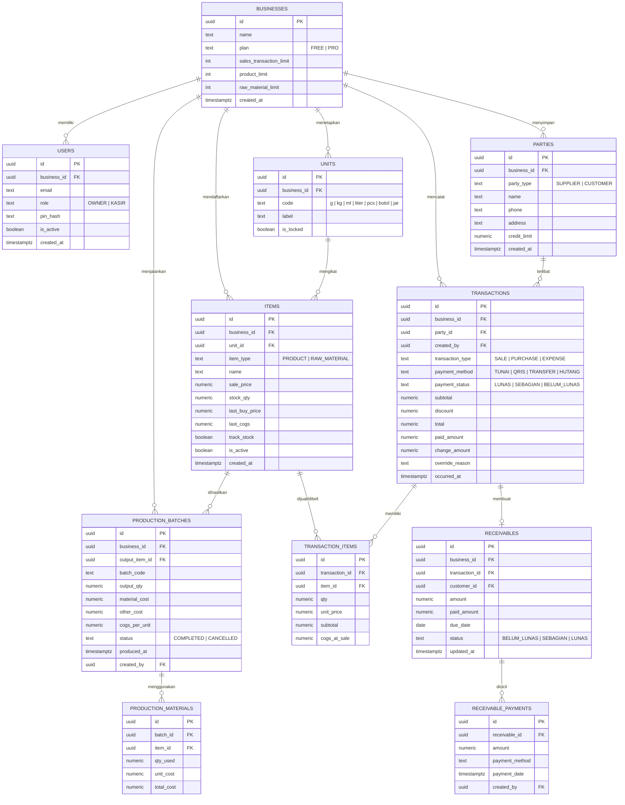
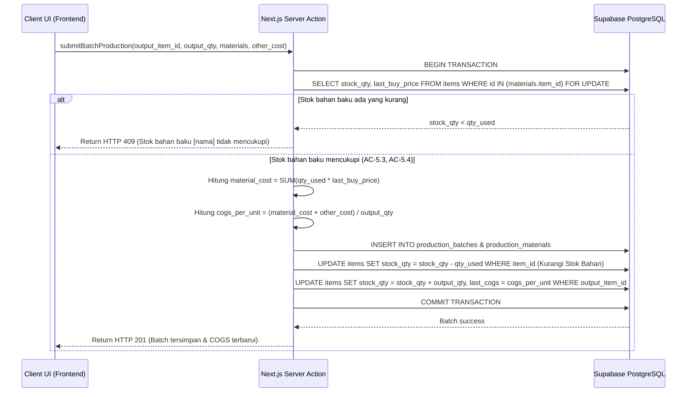
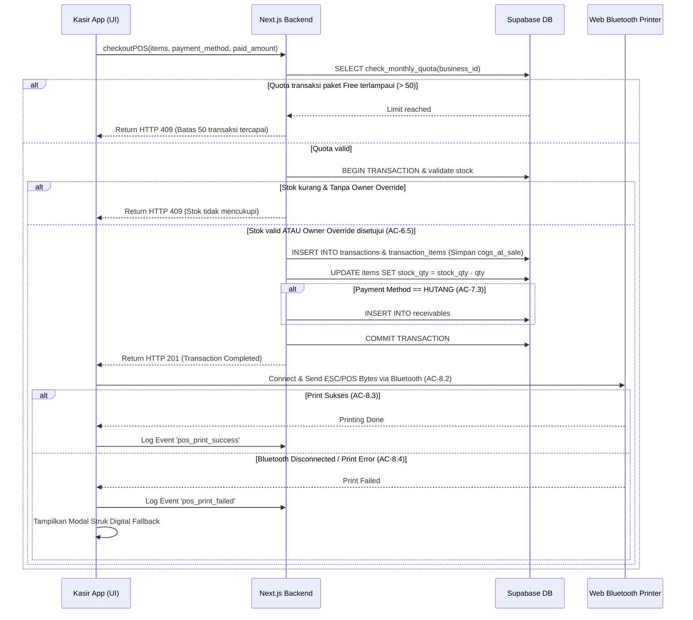

# Tech Specs: DapurKasir SaaS POS & Financial Management

## Overview

DapurKasir adalah aplikasi SaaS berbasis Web PWA yang dirancang khusus untuk UMKM kuliner skala produksi (seperti produsen sambal, chili oil, surabi, cireng isi, dan kue). Sistem ini mengintegrasikan Kasir (POS) berkecepatan tinggi, pencatatan stok bahan baku dan produk jadi, produksi batch dengan akumulasi biaya otomatis, perhitungan Harga Pokok Penjualan (COGS/HPP), piutang pelanggan, utang supplier, serta pengeluaran operasional secara terintegrasi (US-1 s.d. US-10).

Pendekatan arsitektur menggunakan **Next.js App Router** (TypeScript) untuk frontend dan backend (Server Actions / Route Handlers) yang dipadukan dengan **Supabase PostgreSQL** sebagai basis data berarsitektur *multi-tenant* berbasis *Row Level Security* (RLS). Aplikasi ini dikembangkan dengan filosofi *mobile/tablet-first* (US-10), mengedepankan performa *pencarian produk di bawah 200ms* (AC-6.1), enkapsulasi validasi transaksi stok secara atomic pada level basis data, serta integrasi langsung ke printer thermal Bluetooth 58/80 mm via **Web Bluetooth API** dengan *fallback* struk digital (US-8, AC-8.4).

## Architecture

Aplikasi DapurKasir terbagi menjadi 3 layer utama: Client Layer (PWA UI), Server Layer (Next.js Edge/Node runtime), dan Data Layer (Supabase PostgreSQL + Auth).

```
+-----------------------------------------------------------------------+
|                            CLIENT LAYER                               |
|  +-----------------------------------------------------------------+  |
|  | Next.js React UI (Tailwind CSS + shadcn/ui)                      |  |
|  | - Mobile/Tablet Responsive POS Shell                            |  |
|  | - State: Zustand (Cart/Session) + TanStack Query (Server Data)  |  |
|  | - Web Bluetooth Manager (ESC/POS Driver 58/80mm)               |  |
|  +-----------------------------------------------------------------+  |
+-----------------------------------+-----------------------------------+
                                    | HTTPS / WebSockets
+-----------------------------------+-----------------------------------+
|                            SERVER LAYER                               |
|  +-----------------------------------------------------------------+  |
|  | Next.js App Router (Server Actions & Route Handlers)            |  |
|  | - Middleware (Session Validations & Role Enforcements)          |  |
|  | - Quota Limit Guard (Free vs PRO Checkers)                      |  |
|  | - Production COGS Engine & Stock Mutator                        |  |
|  | - Finance & Report Aggregation Services                         |  |
|  +-----------------------------------------------------------------+  |
+-----------------------------------+-----------------------------------+
                                    | Supabase JS SDK (Service / Client)
+-----------------------------------+-----------------------------------+
|                            DATA LAYER                                 |
|  +-----------------------------------------------------------------+  |
|  | Supabase PostgreSQL Database                                    |  |
|  | - Multi-Tenant Data Isolation (RLS Policies on business_id)     |  |
|  | - Stored Procedures (Atomic Stock Deduction & COGS updates)     |  |
|  | - Supabase Auth (JWT Engine for Owner & Kasir PIN claims)       |  |
|  +-----------------------------------------------------------------+  |
+-----------------------------------------------------------------------+
```

### Komponen Utama & Interaksi

1. **Multi-Tenant Isolation & Security Model (US-1, US-10)**:
   Setiap baris data pada seluruh tabel operasional diikat oleh `business_id`. Akses data diverifikasi secara *real-time* melalui Supabase RLS Policy berbasis JWT Token. Pengguna dengan peran `OWNER` memiliki akses penuh ke seluruh fitur dan pengaturan, sedangkan peran `KASIR` dibatasi secara ketat oleh Middleware dan RLS sehingga hanya dapat mengakses endpoint POS, pembuatan transaksi, dan pencetakan struk (AC-1.4, AC-1.5).

2. **Authentikasi Kasir via PIN Hash (US-1, AC-1.4)**:
   Owner didaftarkan via Supabase Auth standard (email/password). Untuk Kasir, Owner membuat profil kasir di dalam bisnisnya. Login Kasir dilakukan dengan memasukkan PIN 6 digit yang dicocokkan terhadap `pin_hash` (menggunakan bcrypt/argon2) melalui custom RPC handler yang memancarkan *short-lived session token* khusus peran Kasir.

3. **Quota Limit Enforcement Layer (US-2)**:
   Sebelum eksekusi penambahan produk (AC-2.3), bahan baku, atau konfirmasi transaksi POS (AC-2.4), Server Action mengeksekusi middleware `checkBusinessQuota()`. Jika `plan == 'FREE'` dan penggunaan melebihi ambang batas (50 transaksi/bulan, 30 produk, 10 bahan baku), sistem menghentikan transaksi dan mengembalikan kode status HTTP `409` atau error response terstruktur.

4. **Web Bluetooth Printing Engine (US-8)**:
   Integrasi printer thermal menggunakan Web Bluetooth API langsung di browser client (AC-8.2). Driver kustom mengonversi keranjang transaksi menjadi perintah mentah ESC/POS (byte array) yang dikirim ke *characteristic* Bluetooth GATT printer. Jika koneksi gagal, sistem beralih ke *fallback modal* struk digital (AC-8.4).

## Data Model

Sistem data dirancang terstruktur menggunakan data tipe presisi tinggi (`numeric(15,2)`) untuk seluruh transaksi finansial demi mencegah error pembulatan floating-point.



### Spesifikasi Tabel & Constraint Utama

1. **`businesses`**: Data master tenant. Restriksi `plan` menentukan *limit constraint* pada aplikasi (AC-2.1).
2. **`units`**: Sistem inisialisasi default 7 unit terintegrasi (`g`, `kg`, `ml`, `liter`, `pcs`, `botol`, `jar`) bertanda `is_locked = true` saat onboarding usaha baru (AC-3.1).
3. **`items`**: Memisahkan Produk Jadi (`PRODUCT`) dan Bahan Baku (`RAW_MATERIAL`) melalui `item_type`. `last_cogs` dan `last_buy_price` selalu terbarui secara rasional saat produksi/pembelian (AC-4.2, AC-5.4).
4. **`transactions` & `transaction_items`**: Menampung transaksi POS penjualan, pembelian bahan baku, dan pengeluaran. Field `cogs_at_sale` pada `transaction_items` mengunci nilai COGS produk pada saat transaksi terjadi untuk keakuratan laporan Laba Rugi retrospektif.
5. **`production_batches` & `production_materials`**: Mencatat rincian formula material dan biaya tambahan (`other_cost`) seperti gas/kemasan untuk menghasilkan `cogs_per_unit` (AC-5.3).

## API Design

Seluruh komunikasi backend memanfaatkan Next.js Server Actions dan Route Handlers yang mengembalikan format JSON standar:

```typescript
type ApiResponse<T> = {
  success: boolean;
  data?: T;
  error?: {
    code: string;
    message: string;
    details?: Record<string, string[]>;
  };
};
```

### 1. Auth & Session Management

- **`POST /api/auth/register-owner`** (US-1, AC-1.1, AC-1.2)
  - **Payload**: `{ email: string, password: string, business_name: string }`
  - **Response 201**: `{ success: true, data: { user_id: string, business_id: string } }`
  - **Response 422**: Validation errors (password < 8 karakter, format email salah).

- **`POST /api/auth/login-cashier`** (US-1, AC-1.4)
  - **Payload**: `{ business_id: string, pin: string }`
  - **Response 200**: `{ success: true, data: { session_token: string, kasir_name: string } }`
  - **Response 401**: PIN tidak valid.

### 2. Batch Production & COGS

- **`POST /api/production/batch`** (US-5, AC-5.1..AC-5.5)
  - **Payload**:
    ```json
    {
      "output_item_id": "uuid",
      "output_qty": 50.00,
      "other_cost": 15000.00,
      "materials": [
        { "item_id": "uuid-bahan-a", "qty_used": 2.50 },
        { "item_id": "uuid-bahan-b", "qty_used": 10.00 }
      ]
    }
    ```
  - **Response 201**: `{ success: true, data: { batch_code: "BATCH-20231025-001", cogs_per_unit: 8500.00 } }`
  - **Response 409**: Stok bahan kurang (`AC-5.5`). Pesan error mengembalikan daftar nama bahan baku beserta stok tersisa.

### 3. POS Transaction & Stock Deduction

- **`POST /api/pos/checkout`** (US-2 AC-2.4, US-6 AC-6.1..6.8, US-7 AC-7.1..7.3)
  - **Payload**:
    ```json
    {
      "payment_method": "TUNAI", // TUNAI | QRIS | TRANSFER | HUTANG
      "party_id": "uuid-customer-optional",
      "due_date": "2023-11-01", // Required if payment_method == HUTANG
      "paid_amount": 100000.00,
      "override_reason": null, // Min 5 char if override stock applied
      "items": [
        { "item_id": "uuid-produk-1", "qty": 2, "unit_price": 40000.00 }
      ]
    }
    ```
  - **Response 201**: `{ success: true, data: { transaction_id: "uuid", change_amount: 20000.00 } }`
  - **Response 409**: Quota Free 50 transaksi tercapai (`AC-2.4`) ATAU Stok produk tidak mencukupi dan tanpa override Owner (`AC-6.4`).

### 4. Receivables & Payments

- **`POST /api/receivables/[id]/pay`** (US-7, AC-7.4, AC-7.5)
  - **Payload**: `{ amount: 50000.00, payment_method: "TRANSFER" }`
  - **Response 200**: `{ success: true, data: { remaining_balance: 0, status: "LUNAS" } }`
  - **Response 422**: Nominal pembayaran 0 atau melebihi sisa tagihan.

### 5. Finance Reports

- **`GET /api/reports/financial?start_date=YYYY-MM-DD&end_date=YYYY-MM-DD`** (US-9, AC-9.3..AC-9.5)
  - **Response 200**:
    ```json
    {
      "success": true,
      "data": {
        "revenue": 1500000.00,
        "cogs": 700000.00,
        "gross_profit": 800000.00,
        "expenses": 150000.00,
        "net_profit": 650000.00
      }
    }
    ```

## Sequence Diagrams

### 1. Batch Production & COGS Calculation Flow



### 2. POS Checkout & Printing Thermal Struk Flow



## Error Handling

1. **Quota Exceeded Handling (US-2)**:
   - Apabila bisnis dengan paket `FREE` mencoba melebihi batas limit (30 produk, 10 bahan baku, 50 transaksi POS/bulan), sistem memberikan respon *HTTP 409 Conflict*. 
   - UI menangkap error ini dan secara otomatis memicu komponen Modal `UpgradeToProDialog` dengan tombol CTA langsung ke halaman pembayaran/upgrade paket.

2. **Stock Validation & Overdraw Control (US-6, AC-6.4, AC-6.5)**:
   - Eksekusi transaksi POS mengecek ketersediaan stok produk secara atomik di basis data dengan klausul `FOR UPDATE`.
   - Apabila stok kurang dan peran pengguna adalah `KASIR`, transaksi diblokir (*HTTP 409*).
   - Apabila pengguna adalah `OWNER`, sistem memberikan opsi prompt validasi dialog: "Stok kurang. Masukkan alasan override (min 5 karakter)". Transaksi hanya diproses jika alasan telah diverifikasi server.

3. **Bluetooth Thermal Printer Exception & Fallback (US-8, AC-8.4)**:
   - Kegagalan pencetakan fisik (koneksi terputus, kertas habis, Bluetooth mati) **TIDAK BOHLEH** membatalkan transaksi keuangan yang telah tersimpan di basis data.
   - Pemicu print dibungkus dalam blok `try...catch`. Jika terjadi exception, pemicu akan mencatat audit log `pos_print_failed` dan membuka *fallback view* berupa Struk Digital (komponen SVG/HTML receipt) yang dapat langsung di-share via WhatsApp Web API atau diunduh dalam bentuk citra/PDF.

4. **Form Input Validation (US-3, AC-3.3, US-4, AC-4.4)**:
   - Seluruh input form di-validasi pada dua tingkat: Client-side (menggunakan **Zod** + **React Hook Form**) dan Server-side (Zod schema validation di Server Actions).
   - Error validasi dikembalikan dalam format HTTP 422 Unprocessable Entity beserta pemetaan field error terstruktur.

## Testing Strategy

### 1. Unit Testing (Jest / Vitest)
- **Perhitungan COGS Produksi (AC-5.3)**: Memastikan kalkulasi `(material_cost + other_cost) / output_qty` menghasilkan angka desimal presisi (pembulatan 2 angka desimal) dan menangani skenario *divide-by-zero*.
- **Kalkulator Kembalian Kasir (AC-6.6, AC-6.7)**: Memastikan `paid_amount - total` terhitung tepat dan tombol bayar non-aktif apabila `paid_amount < total`.
- **ESC/POS Command Generator (AC-8.2)**: Verifikasi fungsi pengonversi objek transaksi menjadi buffer byte string ESC/POS 58mm dan 80mm.

### 2. Integration Testing (Playwright / Supabase Test Helpers)
- **Atomic Stock Deduction & Rollback**: Menguji dua transaksi bersamaan (*concurrent checkout*) pada produk dengan sisa stok 1 untuk memastikan tidak terjadi kondisi *race-condition* atau stok negatif tanpa izin.
- **Tenant Data Isolation (RLS Checks) (US-10)**: Memastikan permintaan API dari `business_A` menggunakan token JWT valid tidak dapat membaca atau mengubah data milik `business_B`.
- **Free Plan Quota Enforcement (AC-2.3, AC-2.4)**: Simulasi transaksi POS ke-51 pada bisnis `FREE` untuk memastikan respon pemblokiran 409 berjalan sesuai spesifikasi.

### 3. End-to-End (E2E) Testing (Playwright)
- **Alur Setup Usaha sampai Penjualan**: 
  1. Register Owner → Auto Setup Unit (AC-3.1).
  2. Input 1 Bahan Baku & 1 Produk Jadi.
  3. Eksekusi 1 Batch Produksi (Stok Bahan berkurang, Stok Produk bertambah, COGS terisi).
  4. Buka POS → Cari Produk → Checkout Tunai.
  5. Verifikasi laporan Keuangan Dashboard (Omzet, COGS, Laba Kotor terisi otomatis).

## Implementation Considerations

1. **Ketersediaan Offline & Sinkronisasi (Offline-Light)**:
   - Meskipun sistem berbasis online utama, catalog produk POS dan cart disimpan pada `Zustand` dengan *persist middleware* (IndexedDB/LocalStorage).
   - Apabila koneksi internet terputus secara tiba-tiba saat transaksi, transaksi POS sementara disimpan di antrean lokal (`offline_queue`). Begitu indikator navigator menunjukkan `online`, sistem menyinkronkan antrean ke server secara berurutan.

2. **Performa Pencarian Katalok Produk (US-6, AC-6.1)**:
   - Katalok produk aktif pada POS di-cache pada level client menggunakan `TanStack Query` dengan `staleTime: 5 minutes`.
   - Pencarian produk dilakukan secara client-side *in-memory filtering* (menggunakan library Fuse.js atau string matching sederhana) sehingga respon pencarian untuk 100+ item dijamin di bawah 200 ms tanpa memicu *network round-trip*.

3. **Limitasi Web Bluetooth pada Perangkat iOS**:
   - Web Bluetooth API didukung secara bawaan pada Chrome Android dan desktop Chromium, tetapi **TIDAK** didukung oleh iOS Safari.
   - Implikasi Desain: Aplikasi akan mendeteksi browser user agent. Jika diakses dari iOS Safari, tombol `Cetak Struk` via Bluetooth disembunyikan/dinonaktifkan secara otomatis, dan sistem beralih menjadikan *Struk Digital / Share via WA / AirPrint PDF* sebagai alur utama pencetakan.

4. **Integritas Historis COGS pada Laporan Laba Rugi**:
   - Nilai COGS produk dapat berubah seiring waktu akibat perbedaan harga beli bahan baku pada batch produksi yang berbeda.
   - Keputusan Desain: Tabel `transaction_items` wajib menyimpan snapshot `cogs_at_sale` pada detik transaksi dibuat (US-9, AC-9.4). Laporan Laba Rugi retrospektif dihitung dari `cogs_at_sale * qty`, bukan dari `last_cogs` terkini pada master produk.