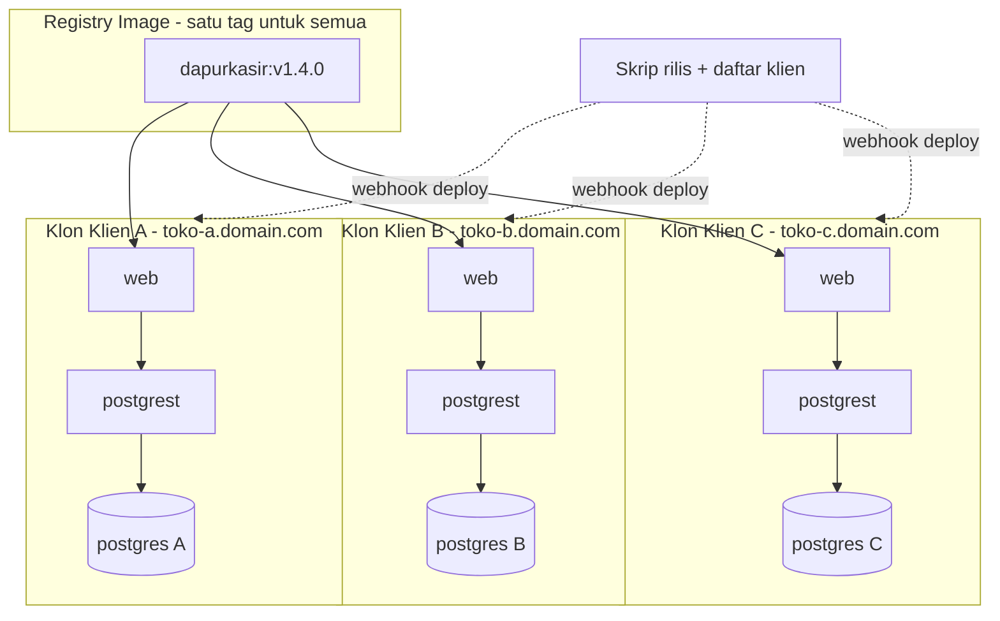
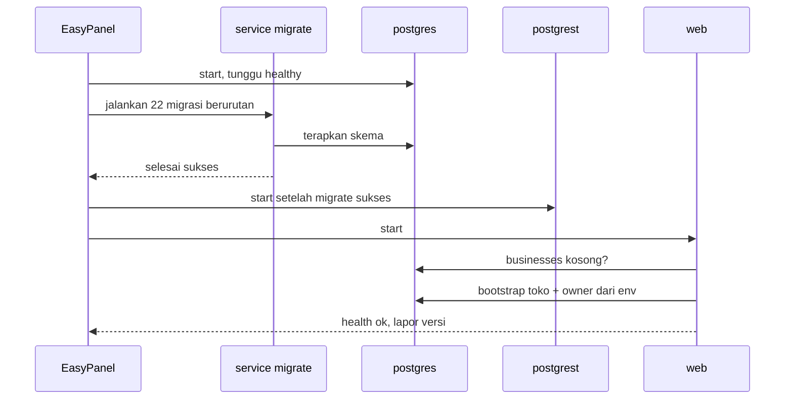

# PRD — DapurKasir: 1 App = 1 Toko (Model Klon per Klien)

> Status: **KEPUTUSAN DIAMBIL — Opsi D. Tiap klien dapat deployment sendiri.**
> Dibuat: 29 Agustus 2026 · Branch: `claude/saas-multi-toko-planning-fb0403`
>
> **Keputusan Rizky (29 Agu 2026):**
> - Model: **1 app = 1 toko, di-klon per klien** — bukan 1 app melayani banyak toko
> - Pendorong: database sering "miss", dan mau sesederhana mungkin
> - Skala sekarang: **1 akun trial**
> - Opsi A (shared+RLS), B (schema per toko), dan C (DB per toko dalam 1 app) **ditolak**
>
> **Asumsi yang saya ambil — koreksi kalau salah:** kode aplikasi **tidak dirombak**. Mesin multi-tenant yang ada (`business_id`, RLS) dibiarkan menganggur dengan tepat satu toko di tiap klon. Alasannya di Bagian 4.

---

## 1. Overview

Tiap klien F&B mendapat deployment sendiri: database sendiri, aplikasi sendiri, domain sendiri. Tidak ada data klien yang bercampur di mana pun, karena secara fisik memang tidak pernah bertemu.

Yang dijual bukan akun di satu aplikasi bersama, tapi **instalasi milik sendiri**.

---

## 2. Temuan Kunci: Ini Sudah 80% Jadi

Sebelum bikin rencana besar, saya baca ulang `docker-compose.yml` dan `DEPLOY_EASYPANEL.md`. Hasilnya:

**Aplikasi ini sudah dideploy dengan model klon.** `DEPLOY_EASYPANEL.md` Bagian 6 secara harfiah menulis: *"Buka `/register` untuk membuat owner dan bisnis pertama."* Satu stack = satu instalasi = satu toko. Itu persis Opsi D.

Yang sudah siap dipakai:

| Kebutuhan model klon | Status | Bukti |
|---|---|---|
| Template stack lengkap per klien | ✅ Ada | `docker-compose.yml` — postgres + migrate + postgrest + web |
| Secret di-inject per instalasi | ✅ Ada | semua lewat env, tidak ada yang di-hardcode |
| Migrasi otomatis tiap deploy | ✅ Ada | service `migrate` one-shot, `postgrest` menunggunya sukses |
| Migrasi aman diulang | ✅ Ada | seluruh 22 file idempotent |
| Migrasi manual dari container | ✅ Ada | `sh db/migrate.sh` — `psql` + folder migrasi ikut di image |
| Health check | ✅ Ada | `GET /api/health` |
| Volume data persisten | ✅ Ada | `dapurkasir_pgdata` |
| Runbook deploy | ✅ Ada | `DEPLOY_EASYPANEL.md` |
| Alat isi/hapus data trial | ✅ Ada | `TRIAL_TOOLS_ENABLED` |

**Artinya ini bukan proyek 1–2 minggu bikin arsitektur baru.** Yang kurang cuma pagar pengaman dan otomasi. Estimasi turun jadi **~1 minggu** (rincian di Bagian 11).

Yang belum ada:
1. **Kunci satu toko** — `/register` sekarang terbuka; klon yang seharusnya 1 toko masih bisa dibikin toko kedua
2. **Bootstrap otomatis** — toko pertama masih dibuat manual lewat form
3. **Strategi rilis ke N klien** — ini risiko terbesar model klon
4. **Backup terjadwal per klien**
5. **UI langganan yang tidak relevan lagi** — halaman `/pricing`, upgrade, limit FREE/PRO, `/admin`

---

## 3. Requirements

- **Aksesibilitas:** Web (Next.js 15), HP kasir + desktop owner
- **Pengguna per klon:** OWNER, KASIR, GUDANG, FINANCE. **Tidak ada** super-admin lintas klien
- **Auth:** JWT cookie `dk_session`, re-sign ke token PostgREST
- **Deploy:** EasyPanel, satu app Compose per klien
- **Domain:** satu subdomain/domain per klien
- **Constraint:**
  - Rilis fitur baru harus sampai ke semua klon — **tanpa** ini, tiap klien pelan-pelan jadi versi berbeda
  - Tidak boleh ada satu pun jalur yang bisa melihat data lintas klien
  - Biaya per klien harus dijaga; tiap klon menambah kontainer

---

## 4. Apa yang Berubah — dan Apa yang Tidak

### Kode aplikasi: TIDAK dirombak

Godaan besarnya adalah "sekalian buang `business_id` dan RLS, kan cuma 1 toko". **Jangan.** Alasannya:

- `business_id` disebut di **34 file TypeScript** dan tertanam di **2.680 baris PL/pgSQL** — termasuk `checkout_pos()`, `create_production_batch()`, `create_purchase()`, `pay_receivable()`. Ini logika yang sudah teruji di produksi.
- Membuangnya butuh ~4–6 minggu, berisiko merusak perhitungan HPP dan stok, dan **tidak memberi satu pun manfaat operasional**. Kolom yang isinya selalu sama nilainya tidak melambatkan apa pun dan tidak membuat apa pun rusak.
- Dengan dibiarkan, pintu kembali ke Opsi B/C tetap terbuka kalau nanti klien terlalu banyak untuk dikelola satu-satu.

Yang menganggur cukup **disembunyikan**, bukan dibongkar.

### Yang benar-benar berubah

| Area | Perubahan | Cara |
|---|---|---|
| Registrasi | Tutup setelah toko pertama ada | Flag `SINGLE_TENANT=true` |
| Toko pertama | Dibuat otomatis saat provisioning | Env `OWNER_EMAIL`, `OWNER_PASSWORD`, `BUSINESS_NAME` |
| Paket FREE/PRO | Dimatikan — klien bayar per instalasi | Paksa `plan = PRO`, lewati `lib/plan-limits.ts` |
| `/pricing`, upgrade, langganan | Disembunyikan | Flag yang sama |
| `/admin` | Disembunyikan | Flag yang sama; tidak ada lintas klien untuk diawasi |
| `/api/health` | Lapor versi app + migrasi terakhir | Supaya tahu klien mana tertinggal |
| Rilis | Skrip update ke semua klon | Registry tag + webhook deploy |
| Backup | Terjadwal per klon | `pg_dump` + retensi |

**Catatan penting:** semua di atas dikendalikan **satu flag env**. Kode tetap satu basis untuk semua klien — tidak ada cabang per klien, tidak ada file yang di-copy-paste. Itu syarat mutlak supaya rilis tetap waras.

---

## 5. Core Features

### 5.1 Mode Toko Tunggal (Must-have)
`SINGLE_TENANT=true` mengaktifkan:
- `register_business()` menolak kalau sudah ada 1 baris di `businesses`
- Route `/register`, `/pricing`, `/api/subscription/*`, `/admin` mengembalikan 404
- `lib/plan-limits.ts` melewati semua pengecekan limit
- Menu langganan/upgrade hilang dari UI

Pertahanan berlapis: penolakan ada di **level SQL**, bukan cuma di UI — supaya tidak bisa ditembus lewat API langsung.

### 5.2 Bootstrap Otomatis (Must-have)
Saat klon pertama kali menyala, kalau `businesses` kosong dan env owner terisi:
1. Buat bisnis + user OWNER dari env
2. Seed unit default
3. Tandai selesai supaya tidak jalan dua kali

Hasilnya: klien buka domain → langsung halaman login, tidak ada langkah manual.

### 5.3 Skrip Provisioning Klien Baru (Must-have)
Satu perintah menghasilkan: secret acak (`SESSION_SECRET`, `POSTGREST_JWT_SECRET`, password DB), berkas env siap tempel ke EasyPanel, dan catatan klien di daftar internal.

Target: klien baru online < 15 menit, tanpa menyalin secret secara manual.

### 5.4 Strategi Rilis ke Semua Klon (Must-have — ini yang paling menentukan)
Tanpa ini, model klon runtuh pelan-pelan. Rancangannya:
- **Satu image, satu tag.** Build sekali, push ke registry. Semua klon menarik tag yang sama — bukan build sendiri-sendiri dari Git.
- **Migrasi jalan sendiri.** Sudah beres: service `migrate` sudah jalan tiap deploy dan idempotent.
- **Daftar klien** berisi nama, domain, dan webhook deploy EasyPanel.
- **Skrip update batch** memanggil webhook tiap klien, lalu memverifikasi lewat `/api/health`.
- **`/api/health` diperluas** melaporkan versi app dan migrasi terakhir → langsung kelihatan siapa yang gagal naik.

Aturan: **rilis tidak dianggap selesai sampai semua klon melaporkan versi yang sama.**

### 5.5 Backup & Restore per Klien (Must-have)
`pg_dump` terjadwal per klon, retensi 30 hari. Restore satu klien tidak menyentuh klien lain — sifat bawaan model ini. **Uji restore beneran minimal sekali**, jangan cuma ditulis di dokumen.

### 5.6 Nice-to-have (nanti)
- Halaman status internal berisi semua klien + versi + health
- Notifikasi kalau ada klon yang mati atau tertinggal versi
- Template EasyPanel siap-klik supaya provisioning nyaris tanpa terminal

---

## 6. Bentuk Resource per Klien

Dua varian, sama-sama Opsi D:

### Varian D-penuh — isolasi total
Tiap klien: `postgres` + `postgrest` + `web` = **3 kontainer**
- Isolasi paling kuat, klien bisa dipindah ke server lain kapan pun
- Paling boros memori

### Varian D-hemat — Postgres bersama, **1 database per toko** ⭐
Satu server Postgres dipakai bersama; tiap klien punya **database sendiri** di dalamnya. Per klien: `postgrest` + `web` = **2 kontainer**
- Tetap "1 database 1 toko" persis seperti permintaan awal
- Hemat ~1 kontainer + memori Postgres per klien
- PostgREST tidak jadi masalah di sini, karena tiap klien punya PostgREST sendiri yang menunjuk ke database-nya sendiri — inilah yang membedakannya dari Opsi C yang ditolak

**Rekomendasi: mulai dari D-penuh untuk klien trial** (paling sederhana, `docker-compose.yml` bisa dipakai apa adanya), lalu pindah ke D-hemat kalau jumlah klien mulai menekan biaya server. Perpindahannya cuma soal mengganti `PGRST_DB_URI` dan memindah dump.

---

## 7. User Flow

### Flow 1 — Onboarding klien baru
1. Jalankan skrip provisioning: nama klien, domain, email owner
2. Skrip menghasilkan secret + berkas env
3. Buat app Compose baru di EasyPanel, tempel env, arahkan domain
4. Deploy → `migrate` jalan → bootstrap membuat toko + owner
5. Kirim kredensial ke klien
6. Catat klien di daftar rilis

### Flow 2 — Rilis fitur baru
1. Merge ke `main` → CI build image → push tag baru
2. Jalankan skrip update batch
3. Skrip memanggil webhook deploy tiap klien secara berurutan
4. Tiap klon: tarik image → `migrate` jalan → web restart
5. Skrip cek `/api/health` semua klien
6. Yang gagal dilaporkan untuk ditangani manual

### Flow 3 — Klien minta restore
1. Ambil dump terakhir milik klien itu
2. Restore ke database klien itu saja
3. Klien lain tidak terpengaruh sama sekali

### Edge Cases
- **Bootstrap jalan dua kali** → cek `businesses` kosong + kunci di level SQL, bukan cuma flag file
- **Env owner kosong saat deploy pertama** → app menyala tapi tidak ada yang bisa login; harus ada pesan jelas di log
- **Migrasi gagal di 1 klien** → `postgrest` tidak start di klon itu; klon lain aman. Harus kelihatan di laporan rilis, bukan diam-diam
- **Klien menunggak** → hentikan kontainer `web`, data tetap utuh
- **Klien minta datanya** → serahkan dump; tidak ada data klien lain yang ikut, karena memang tidak ada di sana
- **Secret bocor di satu klien** → dampaknya berhenti di klien itu; rotasi cukup di klon tersebut

---

## 8. Architecture

Tidak ada panah antar klon. Itu intinya: tidak ada jalur teknis apa pun yang menghubungkan data klien A ke klien B.

### Alur satu klon menyala

---

## 9. Database Schema

**Tidak ada perubahan skema sama sekali.** Tiap klon memakai 22 migrasi yang sudah ada, apa adanya.

Isinya tetap: `businesses` (tepat 1 baris), `app_users`, `units`, `items`, `parties`, `transactions`, `transaction_items`, `production_batches`, `production_materials`, `production_outputs`, `receivables`, `receivable_payments`, `payables`, `expenses`, `audit_logs`, modul B2B, retur supplier, rekonsiliasi kas, langganan.

Yang berubah cuma **isinya**, bukan bentuknya:
- `businesses` selalu tepat 1 baris
- `plan` dipaksa `PRO` — batas FREE tidak relevan lagi
- Tabel `subscriptions`, `payments`, `upgrade_requests`, `coupons` menganggur. **Dibiarkan** — menghapusnya berarti menyentuh migrasi 008 & 010 dan route terkait tanpa manfaat apa pun.

---

## 10. Design & Technical Constraints

### Tech Stack — tidak berubah
Next.js 15 + React 19 · PostgREST v12.2.12 · PostgreSQL 16 · jose JWT · EasyPanel + Docker Compose

### File yang disentuh
| File | Perubahan |
|---|---|
| `db/migrations/023_*.sql` | Tutup 3 lubang grant + kunci toko tunggal di level SQL |
| `db/migrations/024_*.sql` | Bootstrap toko pertama dari parameter |
| `app/api/auth/register/route.ts` | Tolak kalau `SINGLE_TENANT` dan toko sudah ada |
| `lib/plan-limits.ts` | Lewati pengecekan saat `SINGLE_TENANT` |
| `middleware.ts` | 404-kan `/register`, `/pricing`, `/admin` saat `SINGLE_TENANT` |
| `app/api/health/route.ts` | Lapor versi app + migrasi terakhir |
| `scripts/provision-client.mjs` | **Baru** — generator secret + env |
| `scripts/release-all.mjs` | **Baru** — update batch + verifikasi |
| `clients.json` | **Baru** — daftar klien, domain, webhook (jangan di-commit; simpan di tempat aman) |
| `DEPLOY_EASYPANEL.md` | Perbarui jadi runbook per klien |

Route bisnis — POS, items, produksi, B2B, laporan, mayoritas dari 45 route — **tidak disentuh sama sekali**.

### Business Logic yang TIDAK boleh berubah tanpa konfirmasi Rizky
- Perhitungan HPP produksi: `(biaya_bahan + biaya_lain) / qty_output`, bulat 2 desimal
- Penguncian stok saat checkout (`FOR UPDATE`) dan override stok minus khusus OWNER dengan alasan minimal 5 karakter
- Cek limit kredit piutang sebelum penjualan HUTANG
- Lebar struk 58/80mm
- Limit FREE (50 transaksi, 30 produk) — **dimatikan**, bukan dihapus. Kalau nanti mau jual paket lagi, tinggal dinyalakan.

### Naming Convention
- Nama app EasyPanel: `dapurkasir-<klien>`
- Domain: `<klien>.domainmu.com`
- Tag image: semver `v1.4.0` — jangan `latest`, supaya bisa tahu dan bisa mundur
- Label UI Bahasa Indonesia; fungsi/variabel Bahasa Inggris

---

## 11. Risiko Utama & Mitigasi

Model klon memindahkan kerumitan dari kode ke operasional. Ini jujurnya:

| Risiko | Dampak | Mitigasi |
|---|---|---|
| **Klien jadi beda-beda versi** | Bug muncul di satu klien tapi tidak bisa ditiru di tempat lain. Ini penyakit khas model klon | Satu tag image untuk semua + `/api/health` lapor versi + rilis belum selesai sampai semua sama |
| Rilis manual per klien | Makin banyak klien, makin sering kelupaan | Skrip `release-all.mjs` wajib ada **sebelum** klien kedua |
| Secret dikelola manual | Salah tempel, atau secret dipakai ulang antar klien | Skrip provisioning yang menghasilkan secret acak, tanpa copy-paste manual |
| Tidak ada pandangan menyeluruh | Klon mati berhari-hari tanpa ketahuan | Uptime monitor ke `/api/health` tiap klien |
| Biaya naik linear | 3 kontainer × N klien | Pindah ke Varian D-hemat saat mulai terasa |
| Migrasi gagal diam-diam di 1 klien | Klien itu jalan dengan skema lama | `postgrest` memang sudah menolak start kalau `migrate` gagal — pastikan ini kelihatan di laporan rilis |

**Batas wajar model ini: sekitar 10–15 klien** kalau otomasi rilisnya dikerjakan. Tanpa otomasi, mulai terasa berat di klien ke-3. Lewat 15, pertimbangkan balik ke Opsi B — dan karena kode tidak dirombak, jalan pulangnya masih terbuka.

---

## 12. Roadmap

| Fase | Isi | Estimasi | Catatan |
|---|---|---|---|
| **1** | Migrasi `023`: tutup 3 lubang grant (Bagian 13) | ½ hari | Berdiri sendiri, berguna apa pun keputusannya |
| **2** | Mode toko tunggal — flag + kunci SQL + sembunyikan UI langganan | 1–2 hari | |
| **3** | Bootstrap toko pertama dari env | 1 hari | |
| **4** | Skrip provisioning + runbook klien baru | 1 hari | |
| **5** | `/api/health` lapor versi + skrip rilis batch | 2 hari | **Wajib sebelum klien kedua** |
| **6** | Backup terjadwal + uji restore beneran | 1 hari | |
| | **Total** | **~1 minggu** | |

**Untuk klien trial pertama, Fase 1–3 sudah cukup** (~3 hari). Fase 4–6 boleh menyusul sebelum klien kedua masuk.

---

## 13. Soal "Banyak Miss di Database"

Ini pendorong utama keputusan, jadi perlu jujur: **model klon tidak otomatis menyembuhkannya.** Grant yang salah tetap salah di database mana pun. Perlu perbaikan tersendiri.

### Buktinya nyata
Empat commit terakhir seluruhnya perbaikan lapisan database:

| Commit | Isi |
|---|---|
| `cdf92c5` | `fix(db): repair permission denied on production_outputs` |
| `514e289` | `fix(sync): katalog bahan baku tetap tampil setelah import/tambah manual` |
| `9531178` | `fix(import): template bahan baku 25 baris sekarang bisa masuk database` |
| `7487a03` | pemisahan filter Pelanggan / Mitra B2B |

Ditambah dua migrasi yang isinya murni tambal izin: `021_fix_catalog_grants.sql` dan `022_repair_production_outputs_grant.sql`.

### Akar masalahnya
Migrasi 001 memberi grant lewat `grant ... on all tables in schema public` — dan **`ALL TABLES` hanya berlaku untuk tabel yang ada saat itu**. Tiap tabel baru di migrasi 002–022 harus di-grant ulang manual, dan yang kelupaan muncul sebagai `permission denied` di produksi. Persis yang terjadi pada `production_outputs`: dibuat di 011, baru di-grant di 021, masih perlu ditambal lagi di 022.

### Sebagian sudah diperbaiki
Migrasi `021` **sudah** memasang `alter default privileges in schema public grant ... on tables`. Tabel baru sekarang otomatis dapat grant. Tapi belum menutup semuanya.

### Tiga lubang yang masih tersisa
1. **Hanya `tables`.** Default privileges di 021 tidak mencakup `sequences` maupun `functions`. Migrasi 022 masih harus meng-grant keduanya manual — artinya fungsi atau sequence baru berikutnya akan gagal lagi dengan cara yang sama.
2. **Terikat ke role pembuat.** `ALTER DEFAULT PRIVILEGES` hanya berlaku untuk objek yang dibuat oleh role yang menjalankannya. Migrasi 001 dan 022 sama-sama punya blok `format('... %I', current_user)` dengan penangkap `insufficient_privilege` — pertanda role yang menjalankan migrasi memang berbeda antar lingkungan. Kalau role-nya beda, default privileges itu **tidak ikut berlaku**.
3. **Grant, RLS, dan `SECURITY DEFINER` tercampur.** Migrasi 022 harus menambal ketiganya sekaligus untuk satu tabel. Tanpa pola baku, tiap tabel baru berpotensi salah di salah satu dari tiga lapis itu.

### Bonus dari model klon
Ada satu penyembuhan nyata yang datang dari keputusan ini: karena tiap klon cuma punya **satu** toko, seluruh kelas bug "RLS memfilter data yang seharusnya kelihatan" jadi tidak mungkin terjadi lagi — tidak ada tenant lain untuk disaring.

RLS boleh tetap menyala sebagai jaring pengaman (dan `check_request` tetap menolak request tanpa JWT). Tapi kalau nanti masih ada gejala data hilang tanpa sebab, mematikan RLS di klon toko tunggal adalah opsi yang sah — di sana RLS memang sudah tidak melindungi apa pun.

**Rekomendasi:** kerjakan **Fase 1** lebih dulu. Setengah hari, langsung menghentikan pendarahan di produksi hari ini, dan ikut terbawa ke tiap klon baru karena migrasinya jalan otomatis.

---

## 14. Pertanyaan Terbuka

| # | Pertanyaan | Status |
|---|---|---|
| 1 | Model isolasi | ✅ Opsi D — klon per klien |
| 2 | Skala | ✅ 1 akun trial dulu |
| 3 | Kode dirombak atau tidak | ⚠️ **Saya asumsikan TIDAK** (Bagian 4). Koreksi kalau maunya beda |
| 4 | Varian resource | Mulai D-penuh, pindah D-hemat kalau biaya menekan |
| 5 | Toko yang sudah jalan di produksi | ❓ Ada berapa? Perlu tahu sebelum Fase 2 — kalau satu database sekarang isinya lebih dari satu toko, perlu langkah pemisahan |
| 6 | Registry image | ❓ Sudah punya? Perlu di Fase 5, belum perlu untuk trial |

---

*Belum ada kode implementasi yang ditulis.*
